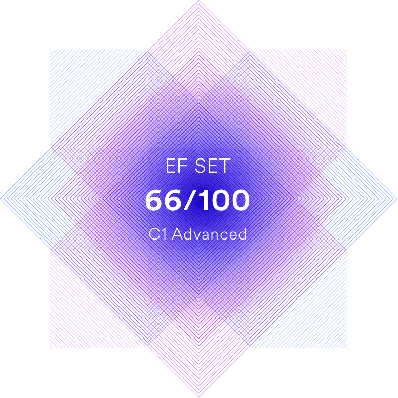

<picture>

</picture>
👋 Hi, I'm @w4ri0, a 23 y/o french develloper 🇫🇷

👀 I'm interested in exploring the ever-evolving landscape of web development, particularly in the areas of front-end design and back-end development. I'm fascinated by the intricate workings of web applications and the creative possibilities they offer.

🌱 I'm currently learning the fundamentals of web development, including HTML, CSS, and JavaScript. I'm also exploring various frameworks and libraries, such as React and Node.js, to expand my skillset and tackle more complex projects.

💞️ I'm eager to collaborate with fellow developers, whether experienced veterans or enthusiastic newcomers, to learn from their expertise and contribute my own knowledge and skills. I'm particularly interested in working on open-source projects and participating in hackathons to gain valuable experience and make a tangible impact.

📫 You can reach me via email at  or through direct messages on social media platforms like Twitter and GitHub. I'm always open to connecting with fellow developers and discussing our shared passion for web development.
